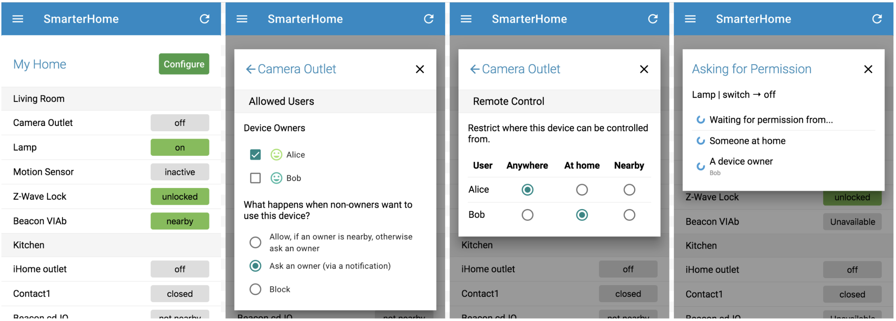

# SmarterHome

SmarterHome is a prototype smart home control app for experimenting with
features to improve the UX of multi-user smart homes. The SmarterHome app
(compatible with web, iOS, and Android) is used to control an existing Samsung
SmartThings smart home, and provides additional features such as:
- Parental Controls
- Location-Based Access Control
- "Ask for Permission" Access Control (aka Reactive Access Control)
- Proximity-Scoped Notifications about Device Activity
- Password-less QR Code Authentication (Public Key Authentication)

A demo of the app, and documentation for building and running your own instance
of SmarterHome is a work-in-progress. If you have questions, please file an
issue or reach out directly to [@eric-zeng](https://github.com/eric-zeng).

SmarterHome was created by Eric Zeng and Franziska Roesner, as part of a
research project of the Paul G. Allen School of Computer Science & Engineering.
This research was supported in part by the National Science Foundation under
Award CNS-1513584. You can read more about this project here:

> [Zeng, Eric and Franziska Roesner. “Understanding and Improving Security and Privacy in Multi-User Smart Homes: A Design Exploration and In-Home User Study.” USENIX Security Symposium (2019).](https://www.usenix.org/conference/usenixsecurity19/presentation/zeng)

